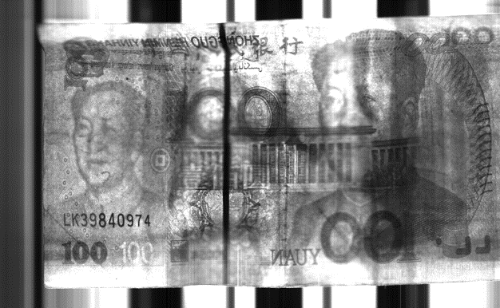

 

     <h1>Shuang Liu</h1>
     

         
             
             live:liushuangvision
         
         
             
             liushuangvision@gmail.com
         
     

 

 ##  EDUCATION

- **Ph.D.**; *University of Chinese Academy of Sciences, Mechanical and Electronic Engineering*, 2014-2020.1.
 --*Research fields: robotic vision, deep learning, detection, pose estimation and marine robots.*
- **Ph.D. joint education program**; *Tohoku University (Japan)*, 2016-2017.
- **Master of engineering**, *Shenyang University of Technology (China)*, Computer Technology Application, 2011-2014.
 -- *Research fields: image processing and pattern recognition.*
- **Bachelor of engineering**; *Shenyang University of Technology (China)*, Computer Science and Technology, 2007-2011.

##  HONORS \& AWARDS

- **National scholarship for studying abroad**; *awarded by China Scholarship Council (CSC),* 2017.
- **The first prize academic scholarship**; *awarded by University of Chinese Academy of Sciences*, 2015.
- **Second prize, Oceanology International China 2015 China Underwater Vehicle Contest**; *awarded by Chinese Society of Oceanography*, 2015.
- **Best creativity award, Conference on Development and Prospects of  Unmanned Systems**; *awarded by China Command and Control Council*, 2014.
- **Outstanding graduates awards for graduate students**; *awarded by Shenyang University of Technology*, 2014.
- **National scholarship for graduate students**; *awarded by Ministry of Education of the People's Republic of China*, 2013.
- **Outstanding graduates awards for undergraduate students**; *awarded by Shenyang University of Technology*, 2011.

##  LANGUAGES
- **English**: &nbsp;&nbsp; Good command in English.
- **Japanese**: The Japanese Language Proficiency Test (JLPT)  N2.
##  SELECTED PROJECTS

- **Visual Navigation for Autonomous Underwater Docking [[Video1](https://drive.google.com/file/d/1SiVgtwZ7g7BMi8i4mPz5fptAqTC-GnBC/view?usp=sharing)] [[Video2](https://drive.google.com/open?id=150qfsnMjmWUnWlwzXiC6R-kSfGU34R37)]**
 --*Tools: python, Tensorflow, Jetson TX2 &nbsp;&nbsp;&nbsp;&nbsp;&nbsp;&nbsp;&nbsp;&nbsp; Duration: 2015-2019*
 Potential of using autonomous underwater vehicles (AUVs) struggles with its finite on-board energy and data storage capacity. Underwater docking has been popularly used due to its ability of autonomous battery recharging and data transfer, making long-term underwater residence possible. A vision based underwater docking algorithm was proposed for the final short-range stage precise docking. Reliable docking involves detecting the docking station robustly and estimating the pose between the AUV and the docking station accurately. To this end, we proposed a robust detection method considering domain-shift and an accurate pose estimation method considering unreliable landmarks. The proposed methods have been validated by both AUV docking and AUV recovery tasks and by two months' field trials on a lake.
- [Research on Recognition of Paper Currency Serial Number](https://github.com/vincent341/Paper-Currency-Recognition)
 --*Tools: C, DSP &nbsp;&nbsp;&nbsp;&nbsp;&nbsp;&nbsp;&nbsp;&nbsp;&nbsp;&nbsp;&nbsp;&nbsp;&nbsp;&nbsp;&nbsp;&nbsp;&nbsp;&nbsp;&nbsp;&nbsp;&nbsp;&nbsp;&nbsp;&nbsp;&nbsp;&nbsp;&nbsp;&nbsp;&nbsp;&nbsp;&nbsp;&nbsp;&nbsp;&nbsp;&nbsp;&nbsp;&nbsp;&nbsp;&nbsp;&nbsp;&nbsp;&nbsp;&nbsp;&nbsp;&nbsp;&nbsp;&nbsp; Duration: 2011-2014*
 Recognition of paper currency serial number is of great importance for anti-counterfeit and currency tracing and also basic requirements for advanced currency sorter and currency counter. A novel algorithm was proposed to recognise paper currency serial numbers for a public limited company JULONG Co.,Ltd. (stock code 300202). The accuracy of recognition is 99.7\% while the time consumption is within 5ms. The proposed algorithm has passed the examination and now runs in the currency sorters of banks both in China and Europe.

##  TECHNICAL SKILLS

- **Languages**: C/C++, Python, Matlab
- **Tools**: Tensorflow, Opencv
- **OS**: Linux, Windows
##  PUBLICATIONS
[A Generative Model of Underwater Images for Active Landmark Detection and Docking](https://github.com/vincent341/T2FGAN)
 **S. Liu**, M. Ozay, H. Xu,Y. Lin, and  T. Okatani
  *2019 IEEE/RSJ International Conference on Intelligent Robots and Systems (IROS)*. (accepted) <!---[[Code](https://github.com/vincent341/T2FGAN)][[Video](https://drive.google.com/file/d/1SiVgtwZ7g7BMi8i4mPz5fptAqTC-GnBC/view?usp=sharing)]-->
 [Visual Navigation for Recovering an AUV by Another AUV in Shallow Water](https://www.mdpi.com/1424-8220/19/8/1889/pdf)
 **S. Liu**, H. Xu, Y. Lin, and L. Gao
 Sensors, vol. 19, no. 8, p. 1889, Apr. 2019. (IF:3.031)[[Paper](https://www.mdpi.com/1424-8220/19/8/1889/pdf)]
 
[Detection and Pose Estimation for Short-Range Vision-Based Underwater Docking](https://ieeexplore.ieee.org/stamp/stamp.jsp?tp=&arnumber=8567906)
 **S. Liu**, M. Ozay, T. Okatani, H. Xu, K. Sun and Y. Lin
 IEEE Access, vol. 7, pp. 2720-2749, 2019. (IF:4.098)[[Paper](https://ieeexplore.ieee.org/stamp/stamp.jsp?tp=&arnumber=8567906)][[Video](https://drive.google.com/open?id=150qfsnMjmWUnWlwzXiC6R-kSfGU34R37)]
 
[Learning Deep Representations and Detection of Docking Stations Using Underwater Imaging](https://ieeexplore.ieee.org/document/8559067)
 **S. Liu**, M. Ozay, T. Okatani, H. Xu, Y. Lin and H. Gu
 *2018 OCEANS - MTS/IEEE Kobe Techno-Oceans (OTO)*, Kobe, 2018.
 
[Automated Recovery of the UUV Based on the Towed System by the USV](https://ieeexplore.ieee.org/document/8559320)
 H. Gu, L. Meng, G. Bai, H. Zhang, Y. Lin and **S. Liu**
 *2018 OCEANS - MTS/IEEE Kobe Techno-Oceans (OTO)*.
 
[A Modular Miniature Underwater Robot Design Scheme for Swarm Operations](https://ieeexplore.ieee.org/document/7485357)
 G. Li, T. Gao, L. Dong, **S. Liu**, H. Xu, Y. Lin and Q. Jia
 *OCEANS 2016 - Shanghai*.
 
[Self-organization of hippocampal representations in large environments](https://ieeexplore.ieee.org/document/7280848)
 **S. Liu**, B. Si and Y. Lin
 *2015 International Joint Conference on Neural Networks (IJCNN)*, Killarney.
 
[Paper currency serial numbers location for transmission imaging](http://www.cnki.com.cn/Article/CJFDTotal-SJSJ201410039.htm)
 W. Yuan and **S. Liu**
 Computer Engineering \& Design, 2014. (In Chinese)

##  REFERENCES
- Available upon request
